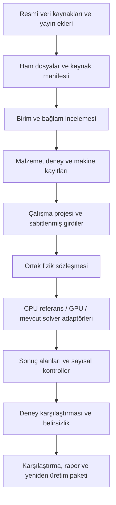

# Metalliksa — Açık Veriye Dayalı Simülasyon ve Dijital İkiz Ana Planı

## Güncel öncelik kararı — 21 Eylül 2026

Kullanıcı ana hedefi **LPBF motorları ve bunları besleyen veritabanı** olarak
netleştirdi. EIS/EDS ve diğer yan araştırma modüllerinin genel onarımı ertelendi;
bu işler LPBF fazlarının kabul kapısı değildir. Ortak malzeme/veri kodu LPBF'yi
doğrudan etkiliyorsa gerekli dar kapsamda incelenir.

**Motorları birleştirme:** Kullanıcının açık ek talebi. LPBF çözücüleri ve yan
modül motorları bağımsız kalır; tek birleşik solver oluşturulmaz. Ortak veritabanı
ve veri alışverişi motor birleştirmesi anlamına gelmez. Her motorun model kimliği,
varsayımları, girdileri, çıktıları ve doğrulama testleri ayrı korunur. Aşağıdaki
eski “ortak termal çekirdek” ifadeleri bu kararla sınırlanmıştır: yalnız ortak
veri sözleşmesi ve bağımsız çözücü adaptörleri; hesap motorlarını birleştirme yok.

Ürün iki çalışma alanı olarak ele alınacak: LPBF üretim/simülasyon çekirdeği ve
ikincil araştırma araçları. İki ayrı uygulama/repo/dağıtım henüz oluşturulmadı.
Ertelenen bulgular [SECONDARY_MODULE_BACKLOG.md](SECONDARY_MODULE_BACKLOG.md).

İlk sıra: LPBF motor testleri ve kanıt sınırları → ortak malzeme otoritesi →
kaynak/hash/birim/deney koşulu izlenebilirliği → SQLite kayıt/transaction/backup
kararı → IN718 deney paketi ve ölçüm karşılaştırması. Mevcut 0–9 fazları bu
LPBF kapsamıyla sürer; ilgisiz yan modüllerin tamamlanması beklenmez.

Tarih: 21 Eylül 2026  
Durum: İncelemeye hazır mimari ve program planı; uygulama başlatılmadı. Belirli bir planlama becerisi veya onay ritüeline bağımlı değildir.  
Sahip: Can Erganiş  
Kapsam: Mevcut Metalliksa uygulamasını geliştirerek doğrulanabilir bir sanal üretim laboratuvarı oluşturmak.

## 1. Amaç ve başarı tanımı

Amaç; açık deney verilerini kaynaklarıyla saklayan, farklı alaşımlar için uygun fizik modellerini çalıştıran, yayımlanmış üretim deneylerini yeniden kuran ve tahminlerinin hata/belirsizliğini gösteren yerel bir araştırma uygulaması geliştirmek.

Kullanıcının makineye erişimi yoktur. İlk ürün, yayımlanmış deneylerin hesaplamalı yeniden üretimi ve senaryo karşılaştırmasıdır. Belirli fiziksel varlıktan sürekli veri alan operasyonel dijital ikiz sonraki bir yetenek olabilir; mevcut hedef bunu gerektirmez.

İlk uçtan uca başarı:

1. Kaynaklı bir deney paketini seç.
2. Alaşım, makine, geometri, proses ve ölçüm koşullarını incele.
3. Eksik girdileri ve modelin sınırlarını gör.
4. Uygun çözücüyle hesap çalıştır.
5. Ölçümle aynı tanıma sahip çıktıları karşılaştır.
6. Girdi, veri, çözücü ve sonuç sürümlerini içeren paketi dışa aktar.
7. Paketi yeniden açıp belirtilen sayısal tolerans içinde sonucu yeniden üret.

Başarı yalnızca daha fazla modül veya daha fazla alaşım değildir. Temel ölçütler: izlenebilir veri kapsamı, tekrarlanabilir çalışma, bağımsız deney hatası, geçerlilik sınırları ve hesap maliyeti.

## 2. Başlangıç durumu ve kanıt sınırı

Bu plan kaynak kodun seçilmiş bölümleri, Graft kartları, proje belgeleri ve resmî dış kaynaklar üzerinden hazırlanmıştır. Bu oturumda solver çalıştırılmadı, paketler yeniden doğrulanmadı ve tarayıcı denetimi yapılmadı.

| Mevcut dayanak | Plan üzerindeki etkisi |
| --- | --- |
| React/TypeScript arayüz, Node API ve Python motorları mevcut | Yığını yeniden yazmak yerine sözleşmeler ve adaptörlerle bütünleştir |
| `SCHEMA.md` içinde Build → ProcessParams → Sample → Properties → Source zinciri var | Yeni kayıt yapısı bunu koruyup simülasyon/deney ayrımını genişletsin |
| `python/four_alloy_materials.py` içinde ortak alaşım çözümleme ve özellik erişimi var | Yeni materyal kayıt sistemi için uyumluluk adaptörü kullan |
| `python/lpbf_simulation.py` içinde girdi/kaynak parmak izi var | Yeniden üretilebilir çalışma kimliğine geliştir; ikinci bağımsız cache sistemi kurma |
| `server/researchEvidenceRegistry.ts` sürüm ve çakışma kontrolü yapıyor | Veritabanına geçerken kaynak revizyonlarını ve çakışma davranışını koru |
| İş istasyonu belgeleri ortak LPBF bağlamı, sonuç eskimesi ve dışa aktarım tarif ediyor | Yeni proje görünümünü mevcut akışın üstüne kur |
| Ortam belgeleri 15 Eylül tarihli Python/CUDA/WSL doğrulaması kaydediyor | Yeniden kurulumdan önce aktif ortamda kısa kontrol yap; tarihsel kanıtı güncel başarı sayma |
| STATUS ve mühendislik belgelerinde farklı olgunluk ifadeleri bulunuyor | İlk aşamada çalışan kod, test ve fiziksel kanıtı ayrı denetle |

Graph generation: 2026-09-18T15:50:24Z. İncelenen kaynaklar için metadata değişmiş göründüğünden ilgili kaynak aralıkları doğrudan okundu. Dokümanlar graph dışında tutuluyor. Bu inceleme tüm kod tabanının eksiksiz denetimi değildir.

## 3. Kapsam ve çalışma ilkeleri

### İlk sürümün kapsamı

- Yerel, tek kullanıcılı çalışma; internet kaynak alımı için isteğe bağlı.
- LPBF odaklı termal hesap, deney karşılaştırması ve senaryo yönetimi.
- IN718 ile ilk deney paketi; mevcut 316L, Ti-6Al-4V ve AlSi10Mg verilerinin düzenlenmesi.
- IN625 için açık deney/veri yeterliliğine bağlı ilk genişleme adayı.
- CPU referansı ve tek bir seçilmiş GPU hesap yolu.
- Kalıcı kayıt, yedekleme, çalışma geçmişi, dışa/içe aktarım.

### İlk sürümün dışında

- Fiziksel makine kontrolü, otomatik G-code gönderimi ve üretim onayı.
- Sertifikasyon veya uçuşa elverişlilik iddiası.
- Her alaşım için tam akış + mikroyapı + mekanik doğruluk iddiası.
- Tüm parçanın çözünür toz taneleriyle tam CFD hesabı.
- Çok kullanıcılı bulut, dağıtık hesap kümesi, ücretli veri/hesap satın alma.
- Başlangıçta yeni büyük yapay zekâ modeli eğitimi.

Mevcut ilgili modüller kaldırılmaz. Bilimsel durumu belirsiz modüller araştırma olarak erişilebilir kalır; ana doğrulanmış akışa otomatik dahil edilmez.

## 4. Hedef mimari

Python fizik ve veri değerlendirme katmanı olarak kalır. Node mevcut API, iş yönetimi ve kalıcı kayıt erişimini sürdürür. Arayüz doğrulanmış API sözleşmelerini kullanır; tarayıcıda farklı bir bilimsel sonuç kaynağı oluşturulmaz.

### Depolama kararı

Öneri: ilk yerel sürümde SQLite ilişkisel metadata veritabanı + dosya tabanlı içerik deposu. SQLite yerel uygulama saklama için uygundur; aynı anda tek yazıcı sınırı tasarımda dikkate alınır [S4]. Node servisinin seri kısa işlemleri kayıtları yazar; solver süreçleri doğrudan ortak uygulama veritabanına yazmaz.

- Veritabanı: kimlikler, ilişkiler, sürümler, koşullar, kaynaklar, inceleme durumu, iş ve artifact referansları.
- Ham kaynak dosyaları: değişmez içerik hash'iyle saklanır.
- Ölçüm tabloları: ilk sürümde şemalı CSV/JSON; ölçek gerektirirse Parquet.
- Büyük alan çıktıları: mevcut VTK akışı korunur; gerektiğinde HDF5/Zarr karşılaştırılarak yalnız biri eklenir.
- Disk doluluğu ve saklama bütçesi görünürdür. Kaynak/sonuç silme otomatik ve sessiz yapılmaz.
- PostgreSQL'e geçiş tetikleyicisi: birden fazla hosttan yoğun eşzamanlı yazma veya çok kullanıcılı servis gereksinimi. İlk fazda ikinci veritabanı işletilmez.

Kesin Node SQLite sürücüsü Faz 0 uyumluluk deneyiyle seçilir. Mevcut bir paketin kurulu olması tercih sebebi değildir; aktif Node sürümü, paket kilidi ve transaction/backup testleri belirleyicidir.

## 5. Veri modeli ve değişmez kurallar

| Varlık | Temel içerik |
| --- | --- |
| Project / Case | Amaç, seçilmiş deney, ilişkili çalışma ve notlar |
| Material / MaterialRevision | Bileşim, wt%/at% temeli, üretim/ısıl işlem durumu, özellik sürümleri |
| PropertyLaw | Özellik, SI birimi, sıcaklık/faz aralığı, tablo/fonksiyon, kaynak, belirsizlik ve ekstrapolasyon kuralı |
| MachineProfile / Revision | Kaynaklı makine/optik bilgiler ve desteklenen parametre aralıkları |
| PowderLot | Tane dağılımı, kimya, paketleme ve yeniden kullanım bilgisi; eksikler açık |
| Build / ProcessParams / Sample | Mevcut zincirle uyumlu fiziksel deney bağlamı |
| Source / Artifact | DOI/URL, sürüm, lisans, erişim zamanı, sayfa/tablo, hash ve yerel konum |
| Observation | Ölçülen büyüklük, yöntem, koordinat/zaman, tekrar grubu, belirsizlik |
| DatasetRevision | Dahil edilen gözlemler ve kalibrasyon/değerlendirme ayrımı |
| ModelVersion | Denklemler, varsayımlar, desteklenen malzeme/koşullar ve backend |
| SimulationRun | Sabit girdi, model/veri sürümleri, donanım, durum, seed ve sonuç manifesti |
| ValidationReport | Tahmin–ölçüm eşleşmesi, metrik, tolerans, kapsam ve başarısızlıklar |

Kurallar:

1. Bilinmeyen değer `null` ve eksiklik nedeni ile saklanır; sıfır veya varsayılan ölçüm gibi sunulmaz.
2. Kaynak birim ve değer korunur; SI dönüşümü ayrıca kaydedilir. wt% ile at% sessizce karıştırılmaz.
3. Ölçüm, literatür tahmini, hesaplamalı özellik ve sentetik veri ayrı türlerdir.
4. Özellik değişikliği yeni revizyon yaratır; eski çalışmalar eski revizyona bağlı kalır.
5. Alaşım adı eşleştirmesi bileşimi veya ısıl işlem durumunu eşdeğer kabul etmez.
6. Sıcaklık aralığı dışına çıkıldığında modelin ilan ettiği politika uygulanır: durdurma veya açıkça etiketli ekstrapolasyon.
7. Aynı yayın/veri dosyasındaki tekrarlar bağımsız dış doğrulama gibi sayılmaz.
8. Veritabanı geçişi mevcut kayıtları kanıt açısından üst seviyeye taşımaz.

### Geçiş ve geri dönüş

Mevcut tarayıcı kayıtları ve sunucu evidence revizyonları salt okunur kopyayla envantere alınır. İçe alma önce kuru çalışır; kayıt sayısı, kimlik, kaynak ilişkisi ve çakışmalar raporlanır. Yeni veritabanında doğrulanan kopya açıldıktan sonra yeni yazma yolu etkinleşir. Eski kayıtlar korunur; çift yazma kalıcı çözüm olmaz. Başarısız geçişte eski okuma yolu seçilir. Yedekleme geri yükleme testi olmadan geçiş tamamlanmış sayılmaz.

## 6. Açık veri programı

### Kaynak öncelikleri

| Öncelik | Kaynak / aday | Rol ve sınır |
| --- | --- | --- |
| P0 | NIST AMB2022-03 IN718 tek iz/pad deneyleri | İlk geometri/termal karşılaştırma adayı; gerçek deney geometrisi ve yüzey koşulları korunur [S1–S3] |
| P1 | NIST AMB2018-01 IN625, AMB2022-01 IN718 | Çok iz/parça/distorsiyon genişlemesi; farklı deney ve modeller ayrı değerlendirilir [S2] |
| P1 | Mevcut 316L ve Ti64 literatür kayıtlarının birincil kaynakları | Eldeki kanıtı yeniden kullanılabilir dataset haline getir; yeni doğrulama olmuş gibi sunma |
| P2 | DOI bağlantılı üniversite depoları ve yayın ekleri | Yöntem, lisans ve koşul yeterliliğine göre seç |
| P2 | Materials Project | Hesaplamalı malzeme araştırması; doğrudan üretilmiş alaşım ölçümü yerine kullanma [S7] |
| P2 | Açık CALPHAD TDB kaynakları | Bileşen/faz/aralık ve lisans kapsaması ayrıca incelenir; pycalphad kurulumu veri kapsamı sağlamaz [S5] |

Veri hattı: keşif → kaynak/lisans kaydı → ham dosya → hash → ayrıştırma → birim/bağlam kontrolü → inceleme → sürümlü dataset.

İlk pilot için hedef: yeterli koşul bilgisi ve ölçüm bulunan en az üç farklı proses koşulu. Tekrarlar aynı koşul grubunda tutulur. Bu sayı bilimsel yeterlilik iddiası değildir; küçük veri pilotudur. Yeterli bağımsız koşul bulunmazsa benchmark etiketi verilmez ve aynı kapsamda uygun başka veri seçilir.

Şunlar eşleştirilmeden sayısal hata üretilmez: genişlik/derinlik tanımı, kesit konumu, zaman referansı, lazer çapı tanımı, tarama hızı birimi, substrat/toz ayrımı, ısıl işlem ve ölçüm yöntemi. Termografide görünür sıcaklık doğrudan gerçek sıcaklık varsayılmaz; emissivite ve ölçüm işleci kaydedilir.

AI/OCR çıkarımı yalnızca aday kayıt üretir. Kaynak tablo ve dönüşüm izi incelenmeden materyal özelliğini değiştiremez. Ağ kesintisi ve değişen kaynak, son bilinen veriyi sessizce bozmaz; indirilen sürüm tekrar kullanılabilir.

## 7. Ortak fizik çekirdeği

Çekirdek tek dev solver değildir. Tüm solverların uyacağı sözleşme ve ortak bilimsel bileşenlerdir.

- Birimler: iç hesapta SI; arayüz dönüşümleri açık.
- Malzeme değerlendirme: k(T), cp(T), faz aralıkları, latent heat ve ilgili model için gerekli diğer özellikler.
- Geometri: koordinat sistemi, mesh kimliği, uzunluk birimi ve aktif bölge.
- Kaynak: normalize lazer gücü, ışın profili, çap tanımı ve tarama zamanı.
- Sınır/başlangıç koşulları: modelden bağımsız seri hale getirilebilir tanım.
- Sayısal ayarlar: ağ, zaman adımı, çözüm toleransı ve bütçe.
- Capability: desteklenen fizik, backend, alaşım yeterliliği ve geçerlilik aralığı.
- Sonuç: alan birimleri, koordinatlar, metrikler, kaynak sürümleri ve sayısal kontrol raporu.

Önerilen arayüz sorumlulukları: `validate_request`, `resolve_material_revision`, `describe_capabilities`, `run_simulation`, `compare_observations`. Bunlar tasarım adlarıdır; mevcut adlarla çakışma ve adaptör sınırları alt planlarda kesinleştirilecektir.

Geliştirme sırası:

1. CPU üzerinde tutarlı termal referans: ısı iletimi, hareketli kaynak ve entalpi/faz değişimi.
2. Aynı sözleşme ve benchmark ile GPU karşılığı.
3. Mevcut akış/Marangoni/buharlaşma modellerinin bağımsız doğrulama ve entegrasyonu.
4. Serbest yüzey/keyhole/ray tracing: enerji ve kütle tutarlılığı ile yerel ölçekte.
5. Termal geçmişten mikroyapı ve termomekanik çıktılar: her aşamanın geçerliliği ayrı.

Tam parça için azaltılmış model, ayrıntılı eriyik havuzu için yerel yüksek çözünürlük kullanılabilir. Modeller arası geçişte alan aktarımı, birim, enerji ve belirsizlik denetlenir. Tek bir ayarla bütün ölçekleri aynı ayrıntıda çözme sözü verilmez.

## 8. Kütüphane ve donanım stratejisi

| Bileşen | Planlanan rol | Kullanım kapısı |
| --- | --- | --- |
| Mevcut NumPy/SciPy yolu | CPU referans, veri işleme ve küçük testler | Seçilmiş fizik ve birim testleri |
| NVIDIA Warp | Mevcut GPU termal motorun geliştirilmesi için ilk aday | Aynı fizik üzerinde CPU eşleşmesi ve bellek ölçümü; platform GPU simülasyonunu destekler [S6] |
| Mevcut OpenFOAM yolu | Gerekli CFD yetenekleri için aday backend | Gerçekte çalışan solver denklemleri ve bağımsız benchmark |
| PyTorch / mevcut FNO altyapısı | Sonraki aşamada vekil model | Dondurulmuş veri seti, ayrılmış değerlendirme ve alan dışı kontrol |
| BoTorch / mevcut optimizasyon | Doğrulanmış aralıkta proses arama | Hedef fizik modelinin güvenilirliği; optimumun tam solverla yeniden kontrolü |
| pycalphad | Uygun veritabanıyla termodinamik hesap | TDB lisansı, bileşen/faz/aralık yeterliliği |
| ParaView / mevcut VTK | Bağımsız alan inceleme | Gerçek solver çıktısını doğru birim ve koordinatla açma |

Yeni bağımlılık ekleme koşulu: karşılanan ihtiyaç + mevcut araçla fark + küçük karşılaştırma + sürüm/lisans uyumu + yeniden kurulum kaydı. İlk aşamada yeni GPU çatısı veya büyük platform kurulumu hedeflenmez.

RTX 4060 Laptop / 8 GiB bilgisi proje kaydıdır; aktif cihazda ölçülerek doğrulanır. Başlangıçta tek ağır GPU işi; tahmini bellek ve gerçek tepe kullanım kaydı. Çalışmalar yüksek çözünürlük öncesi küçük pilotla bütçelendirilir. Kullanılabilir bellek kontrol edilir; OOM sonrası sessiz çözünürlük değişimi yapılmaz. JIT/ısınma süresi ile kararlı çalışma süresi ayrı raporlanır.

## 9. Alaşım genişleme programı

| Dalga | Adaylar | Beklenen çıktı |
| --- | --- | --- |
| A | IN718 | İlk açık deneyle kaynaklı termal karşılaştırma |
| B | 316L, Ti-6Al-4V, AlSi10Mg | Eldeki kayıtların revizyonlu özellik yasaları ve model yeterlilik matrisi; eksik ölçümler açık |
| C | IN625 | Uygun AM-Bench paketiyle yeni alaşım kabul sürecini sınama |
| D | 17-4PH, maraging çeliği, saf Cu/CuCrZr gibi adaylar | Veri taraması sonrası seçilecek genişleme; destek sözü değil |

Bir alaşımın kabulü: kimlik/bileşim temeli → kaynak/işlem durumu → gerekli özellikler → geçerlilik aralıkları → basit fizik kontrolleri → mevcutsa deney karşılaştırması → yetenek etiketi. Eksik veri varsayılan başka alaşımla tamamlanmaz. Kullanıcı tahmini girebilir; bu tahmin ayrı sürüm ve etiket taşır.

Olgunluk: katalog / termal hesap yeterli / akış hesabı yeterli / deney karşılaştırması mevcut / tanımlı kapsamda doğrulanmış. Bunlar tek doğrusal puan değildir; her fizik modeli kendi durumuna sahiptir.

## 10. Makine ve üretim senaryoları

Makine profili: üretici/model (varsa), dalga boyu, ışın çapı tanımı, profil, güç/hız aralığı, gaz ve platform bilgisi, kaynak ve eksikler. Deney kaydı bu profilden ayrı gerçek kullanılan ayarları taşır.

Çıktıdan makine parametresi çıkarımı yapılacaksa tekil çözüm varsayılmaz. Birden fazla absorptivite/ışın çapı/sınır koşulu aynı havuz ölçüsünü verebilir. Ters problem; parametre sınırları, tanımlanabilirlik ve birden fazla olası çözümle raporlanır. Güvenilir sınır bulunamıyorsa kesin makine tespiti iddiası üretilmez.

Sanal sensör karşılaştırmaları gerçek sensörün uzamsal/zamansal çözünürlüğünü ve işleme yöntemini taklit eder. Kaynakta olmayan makine ayrıntıları üretici kataloğundan alınsa bile deneyde ölçülmüş gibi gösterilmez.

## 11. Doğrulama ve kabul politikası

Üç ayrı rapor: yazılım doğruluğu, sayısal doğrulama, deneysel geçerlilik. Biri diğerinin yerine geçmez.

| Kontrol | İlk kabul yaklaşımı |
| --- | --- |
| Birimler/kimlik | Yanlış boyut, wt%/at% karışması, bilinmeyen alaşım ve eksik zorunlu kaynak reddedilir |
| Enerji | Kapalı/yalıtılmış analitik testlerde enerji dengesi; lazer giriş ve sınır çıkışları ayrıca muhasebeleştirilir |
| Yakınsama | En az üç ağ ve üç zaman adımı seviyesi; uzaysal ve zamansal etkiler ayrı incelenir |
| CPU/GPU | Aynı fizik ve girdilerde tanımlı metrik toleransı; aynı hatayı paylaşmaya karşı bağımsız analitik test |
| Deney | Kalibrasyon dışı koşullar; W/D, termal büyüklükler ve tanım/ölçüm belirsizliği birlikte |
| Yeniden üretim | Aynı paket aynı backend'de ilan edilen toleransla tekrarlanır; bit düzeyinde eşitlik zorunlu değil |
| Uygulama | İptal, servis yeniden başlatma, eksik backend, disk dolu, bozuk artifact, eski sonuç ve çakışan kayıt |

İlk mühendislik hedefleri (elde edilmiş sonuç veya evrensel doğruluk standardı değildir):

- Seçilmiş termal testlerde normalize enerji kapanış hatası ≤ %1; payda ve entalpi referansı test tanımında sabitlenir.
- Son iki çözünürlük arasında W/D farkı ≤ %5; ayrıca yakınsama eğilimi ve mümkünse gözlenen mertebe raporlanır. Bu tek başına doğrulama değildir.
- Eşdeğer CPU/GPU termal testlerinde seçilmiş bütünsel metrik farkı ≤ %1; faz sınırlarının ağ hassasiyeti ayrı ele alınır.
- Pilot bağımsız W/D değerlendirmesinde medyan göreli hata ≤ %15 araştırma hedefi; tüm koşullar ve en kötü hata da yayımlanır. Sıfıra yakın ölçümlerde göreli hata yerine mutlak hata kullanılır.

Deney özelindeki nihai toleranslar ölçüm belirsizliği ve kullanım amacıyla, sonuçlara bakılmadan Faz 2'de dondurulur. Başarısız sonuç sonrası tolerans sessizce gevşetilmez; değişiklik gerekçesi ve yeni değerlendirme sürümü kaydedilir. Az veri halinde güven aralığı/olasılıksal doğruluk konusunda güçlü iddia kurulmaz.

## 12. İş paketleri, bağımlılıklar ve çıkış kapıları

Eforlar tek geliştiricinin odaklı iş günü için ön tahmindir. Beklenen veri erişimi, bilimsel model düzeltmeleri ve kullanıcı inceleme beklemeleri dahil değildir. Faz 0 sonrası yeniden tahmin edilir; takvim taahhüdü değildir.

| Faz | Efor | Bağımlılık | Çıktı | Çıkış kapısı |
| --- | --- | --- | --- | --- |
| 0 — Gerçek durum denetimi | 3–5 gün | Yok | Motor/veri/ortam envanteri, baseline ve risk kaydı | Çalışan giriş noktaları, model kanıtı ve boşluklar ayrılmış |
| 1 — Kalıcı kayıt ve sözleşme | 5–8 gün | 0 | SQLite metadata, artifact deposu, sürüm ve geçiş | Kuru geçiş, çakışma, yedekten geri dönüş ve kaynak bütünlüğü testleri |
| 2 — İlk açık deney paketi | 4–7 gün | 0; kayıt için 1 | IN718 aday dataset, ölçüm eşleştirmesi, dondurulmuş değerlendirme protokolü | Kaynak/koşul yeterliliği; kalibrasyon ve test ayrımı |
| 3 — Ortak termal çekirdek | 8–15 gün | 1, 2 | Mevcut solver adaptörü ve CPU termal referans | Analitik test, enerji ve yakınsama kapıları |
| 4 — İlk bütünleşik ürün | 6–10 gün | 3 | Deney aç → çalıştır → karşılaştır → dışa aktar akışı | Yeniden açma/üretme, hata durumları ve deney raporu |
| 5 — GPU ve hesap yönetimi | 5–10 gün | 3; ürün entegrasyonu 4 | GPU eşleştirme, kuyruk, iptal, bellek/süre profili | CPU/GPU uyumu ve ölçülmüş performans; başarısız optimizasyon kabul edilmez |
| 6 — Alaşım ve senaryo genişleme | 6–12 gün | 2, 4 | Mevcut dört alaşımın yeterlilik matrisi, IN625 aday paketi | Yeni alaşım için aynı veri kabul süreci geçilmiş |
| 7 — İleri fizik doğrulaması | 15–30+ gün | 3–6 ilgili kapılar | Seçilmiş akış/keyhole veya termomekanik/mikroyapı hattı | Her model için ayrı benchmark ve aktarım kontrolleri |
| 8 — Hassasiyet ve optimizasyon | 6–12 gün | 4, yeterli doğrulanmış model | Veri önceliklendirme, belirsizlik ve sınırlı parametre araması | Alan dışı kontrol ve optimumun referans solverla doğrulanması |
| 9 — Vekil modeller | 8–15+ gün | 5, 6, yeterli veri | Uygun kapsamda hızlandırılmış tahmin | Grup bazlı ayrılmış değerlendirme, alan dışı davranış ve hata bütçesi |

İlk bütünleşik sürüm Faz 0–4 sonunda yaklaşık 26–45 odaklı iş günü ölçeğindedir. Faz 7 ve 9 araştırma riski taşır; toplam program için kesin bitiş tarihi verilemez. GPU hızlandırması, CPU ile bilimsel olarak anlamlı ilk ürünün ön koşulu değildir.

### Faz 0 ayrıntılı kontrol listesi

- [ ] Kullanıcının mevcut değişikliklerini envantere al; çalışma başlangıç commit'i ve dirty durumunu kaydet.
- [ ] Her görünür motor için UI → API/worker → solver → veri → test bağlantısını çıkar.
- [ ] Kod var / import oluyor / küçük iş çalışıyor / sayısal test var / bağımsız deney var seviyelerini ayrı işaretle.
- [ ] Aktif Python/CUDA/WSL yolunu mevcut environment doctor ile kontrol et; paket yükleme yapma.
- [ ] Mevcut test gruplarını doğru interpreter ile çalıştır; atlanan backend'leri açık yaz.
- [ ] Küçük temsili termal koşuda wall time, tepe RAM/VRAM ve artifact hacmini ölç.
- [ ] Materyal sabitleri ve tekrar eden bilimsel hesapları task-directed graph/source incelemesiyle belirle.
- [ ] Mevcut benchmark ham dosyalarını ve kullanım koşullarını kontrol et; yeniden indirmeden önce hash karşılaştır.
- [ ] SQLite sürücü/transaction/backup uyumluluğunu küçük, ayrı geçici örnekle sınayıp ADR yaz.
- [ ] Doküman çelişkilerini kanıta göre çöz; ilk alt projenin ayrıntılı uygulama planını üret.

### Sonraki fazların iş bölümü

Faz 1: şema/sürüm → artifact manifesti → kayıt repository'si → legacy import → backup/restore → API entegrasyonu.

Faz 2: kaynak manifesti → birim/ölçüm normalizasyonu → koşul ve tekrar grupları → kabul protokolü → dondurulmuş fixture.

Faz 3: input/output sözleşmesi → materyal adaptörü → kaynak/sınır koşulu muhasebesi → analitik testler → yakınsama → deney karşılaştırması.

Faz 4: çalışma seçimi → durum ve eksik veri görünümü → iş çalıştırma → karşılaştırma → tam export/import → uçtan uca test.

Faz 5–9 alt planları ilgili önceki kapı sonuçlarıyla yazılır. Bugünden kesin solver implementasyonu veya dosya satırı taahhüt etmek, denetim bulgularını yok saymak olur. Bu belge program planıdır; satır düzeyinde kod tarifinin yerine geçmez.

## 13. Mevcut entegrasyon yüzeyleri ve önerilen sahiplik

Yollar repo köküne göredir. Mevcut yollar başlangıç inceleme hedefidir; yeni yollar öneridir ve uygulama öncesi en yakın AGENTS.md ile kontrol edilir.

| Alan | Mevcut temas noktası | Önerilen sorumluluk / yeni konum |
| --- | --- | --- |
| Veri sözleşmesi | `SCHEMA.md`, `src/types/lpbfDataFoundation.ts` | Sürümlü çalışma/dataset sözleşmeleri; `schemas/` önerisi |
| Evidence kalıcılığı | `server/researchEvidenceRegistry.ts` | Mevcut API davranışını koruyan `server/data/` repository adaptörü |
| Malzeme | `python/four_alloy_materials.py` | `python/materials/` sürümlü kayıt ve özellik değerlendirme; eski fonksiyonlar adaptör |
| Fizik | `python/lpbf_simulation.py`, mevcut CPU/GPU motorları | `python/physics_core/` ortak sözleşme; motorlar ayrı kalır |
| İş yönetimi | Mevcut LPBF bridge/worker ve orchestrator | Mevcut kuyruk sahibini denetle; ikinci kuyruk kurmadan çalışma manifestini bağla |
| Arayüz | `src/App.tsx`, `src/data/workspaces.ts`, mevcut LPBF/evidence store'ları | `src/features/cases/` çalışma görünümü önerisi; ortak proses kaydını çoğaltma |
| Benchmark | Mevcut `data/benchmark/` ve Python testleri | Her dataset için manifest, kaynak, koşul ve değerlendirme dosyaları |
| İzlenebilirlik | `PROOF.md`, `docs/MODULE_EVIDENCE_INVENTORY.md`, `STATUS.md` | Kanıttan türetilen ortak olgunluk kaydı ve güncel özetler |

Uygulama sırasında bilimsel sözleşme sahipliği önce belirlenir. Paralel çalışma ancak bağımsız sınırlar netleştikten sonra kullanılır; bir ekip aynı materyal sözleşmesini sessizce değiştiremez. Bu plan hazırlanırken alt ajan veya uygulama işi başlatılmadı.

## 14. Kullanıcı deneyimi

Ana akış: Çalışmalarım → Deney seç / yeni senaryo → Veri yeterliliği → Model seç → Hesapla → Ölçümle karşılaştır → Dışa aktar.

Her sonuçta görünür: hangi alaşım revizyonu, hangi model, hangi backend, hangi kaynak, geçerlilik aralığı, eksik veri, hesap zamanı ve sonuç güncelliği. Ayrıntılı modüller bağlama göre önerilir; ana akış tüm laboratuvar ekranlarını bilmeye dayanmaz.

Görselleştirmelerde ortak birim, renk ölçeği ve koordinat tanımı kullanılır. İki senaryo karşılaştırılırken otomatik farklı renk ölçekleri farkı gizlememeli. Görsel yumuşatma ham çözüm çözünürlüğünü değiştirmiş gibi sunulmamalı. Ham sayısal tablo indirilebilir.

Başarısız iş, eksik model, alan dışı girdi ve tahmini özellikler açık durum olarak gösterilir. Yeni arayüzün uygulama dili mevcut proje politikasını izler; Can'a açıklamalar Türkçedir. UI değişikliklerinde ayrıca erişilebilirlik ve gerçek tarayıcı denetimi yapılır.

## 15. Test, yayın ve risk yönetimi

Mevcut komutlar: `npm run lint`, `npm run test:unit`, `npm run build`, `npm run test:lpbf`, `npm run test:lpbf:engineering`, `npm run test:meltpool`; çalışan servisle `npm run test:lpbf:api`. Python komutlarının seçtiği interpreter Faz 0'da doğrulanır. Bu planlama oturumunda bu testler çalıştırılmadı.

Hızlı kontroller her ilgili değişiklikte; pahalı yakınsama/benchmark çalışmaları solver veya materyal yasası değiştiğinde; tam ürün kontrolü faz kapısında yapılır. Her fizik değişikliği eski dondurulmuş benchmark'a karşı gerileme raporu üretir.

| Risk | Önlem / karar |
| --- | --- |
| Açık veri eksik veya koşullar belirsiz | Kapsamı daralt, boşluğu kaydet; sentetik veriyle deney açığını kapatma |
| Birden fazla parametre aynı çıktıyı açıklıyor | Hassasiyet/tanımlanabilirlik analizi; tek kesin ters çözüm verme |
| CALPHAD veritabanı alaşımı kapsamıyor | Eksik faz/bileşen etiketi; yeteneği devre dışı bırak veya açık tahmin yolu |
| Eski kayıtlar kayboluyor | Kopya geçiş, manifest, yedekten geri dönüş testi |
| GPU belleği yetmiyor | Yerel bölge, çözünürlük pilotu, kuyruk; fizik değişikliği görünür |
| Vekil model veri sızıntısı | Dataset/üretim/koşul grubu bazlı split; test verisiyle tuning yapılmaz |
| Çok fazla bağımlılık ve backend | CPU referans + birincil GPU yolu; diğerleri ihtiyaçla etkinleştirilir |
| Belgeler koddan kopuyor | Tek olgunluk kaydı, test/benchmark artifact bağlantıları |
| Mevcut kullanıcı değişiklikleriyle çakışma | Uygulama başlangıcında ayrı değişiklik kapsamı; kullanıcı işini sıfırlama yok |

İlk ürünün bitiş kontrolü:

- [ ] En az bir açık deney paketi kaynağından sonuca izlenebilir.
- [ ] Üç veya daha fazla koşullu pilot varsa ayrım protokolü uygulanmış; yoksa kapsam daraltılmış ve açık yazılmış.
- [ ] Tekrarlanabilir CPU termal hat ve belirtilen sayısal kapılar raporlanmış.
- [ ] Deney hataları başarılı/başarısız ayrımıyla görülebiliyor; doğrulanmış etiketi yalnız kabul edilen kapsamda.
- [ ] Mevcut dört alaşım için gerçek yeterlilik ve boşluk matrisi mevcut.
- [ ] İptal, yeniden başlatma, export/import ve yedekten dönüş çalışıyor.
- [ ] Girdi değişikliği eski sonucun üstüne yazmıyor.
- [ ] Tam CFD, makine kontrolü veya sertifikasyon iddiası yok.

## 16. Karar kaydı ve sonraki adım

Önerilen varsayımlar: tek kullanıcılı yerel ürün; LPBF ilk odak; IN718/NIST ilk aday; SQLite metadata; mevcut Python/Node/React yığını; CPU doğruluğu GPU hızından önce; yeni alaşım eklemede veri kapısı.

Bu varsayımlar kullanıcı incelemesine açıktır. Planın kabulü yeni paket kurulumu, uzak servise veri gönderimi veya kod uygulaması yapılmış olduğu anlamına gelmez. Sonraki somut iş Faz 0 denetimi, ardından bulgulara göre veri temeli ve ilk benchmark alt projelerinin ayrıntılı uygulama planlarıdır.

## 17. Kaynaklar

Dış kaynaklar 21 Eylül 2026 planlaması sırasında kontrol edildi. Kaynaklar altyapı/kapsam kararlarını destekler; Metalliksa'nın doğrulandığını göstermez.

- [S1 — NIST AMB2022-03 sonuç ve ölçüm açıklaması](https://www.nist.gov/document/am-bench-amb2022-03-measurement-and-result-descriptions-v10)
- [S2 — NIST doğrudan veri bağlantıları ve referans rehberi](https://www.nist.gov/ambench/direct-am-bench-data-links-and-referencing-guidance)
- [S3 — NIST AM-Bench programı](https://www.nist.gov/ambench)
- [S4 — SQLite kullanım alanları ve eşzamanlılık sınırları](https://sqlite.org/whentouse.html)
- [S5 — pycalphad dokümantasyonu ve veritabanı girdisi](https://pycalphad.org/docs/latest/api/pycalphad.core.html)
- [S6 — NVIDIA Warp](https://developer.nvidia.com/warp-python)
- [S7 — Materials Project veri sorgulama ve hesaplama kökeni](https://docs.materialsproject.org/downloading-data/using-the-api/querying-data)

Yerel dayanaklar: `AGENTS.md`, `RULES.md`, `SCHEMA.md`, `docs/RESEARCH_WORKSTATION.md`, `docs/MODULE_EVIDENCE_INVENTORY.md`, `docs/ENVIRONMENT_READINESS.md`, `docs/LPBF_ENGINEERING.md`, üst proje `STATUS.md` ve incelenen kaynak aralıkları. Güncel bilimsel yetenekler Faz 0'da test/ölçüm kanıtıyla yeniden değerlendirilecektir.
